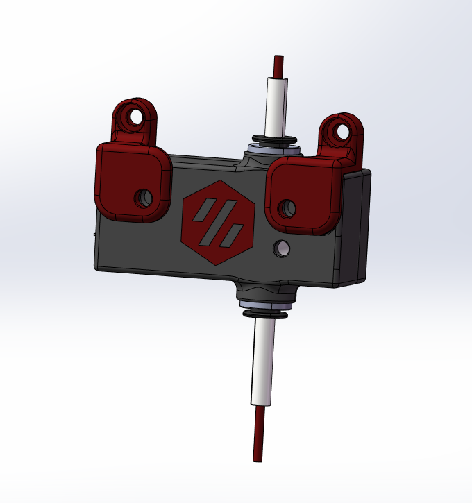
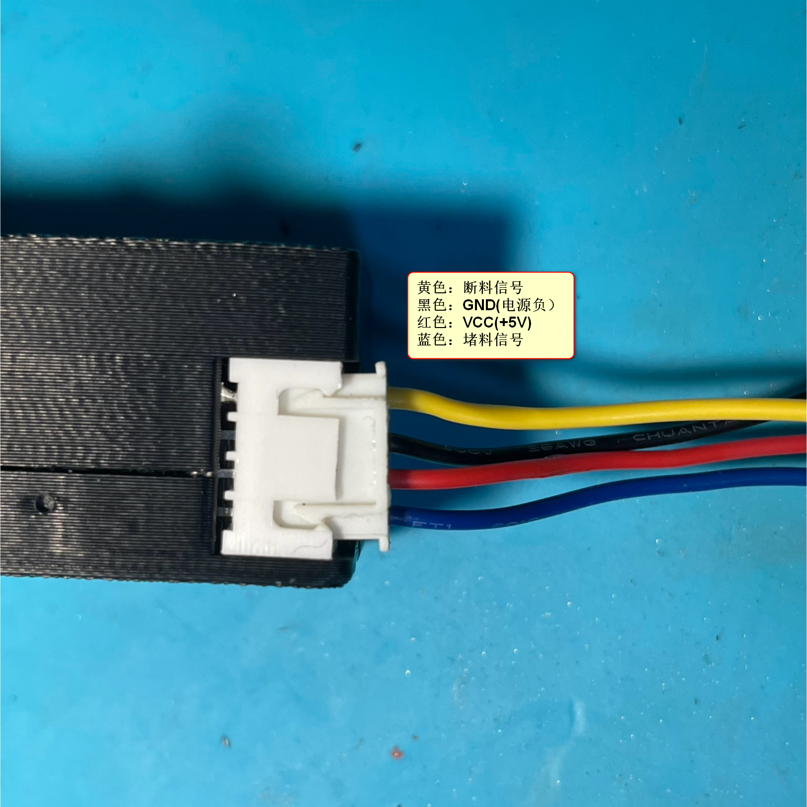

# S4_Filament_sensor [中文说明](./Readme_CN.MD)

## Objectives

### This project originated from[# VORON M4 Extruder](https://github.com/VoronDesign/Mobius-Extruder)，Thank Voron team to facilitate these great project.

#### The objectives for this project are:

 - When the  filament is exhausted or plugged, pause printing to avoid failed printing.


## Overall

### Picture
### 



### Video
 

### [Drawing](./drawing)


## Bill of Materials (BOM)
|NO.	|Category	|Part Name	|Qty	|Remark
|--|--|--|--|--|
|1	|Motion	|effect_0.png			|X1	|
|2	|Needle_Bearings 3x5x7			|X2	|
|3	|Shaft 3x20mm				|X1	|
|4	|Metal_ball 7mm 			|X1	|
|5	|ECAS04 v3				|X2	|
|6	|Electronics	|[TCRT5000](https://)	|X1	|
|7	|Electronics	|XH2.54 4Pin Male Connector|X1	|
|8	|Electronics	|Wire 24AWG  20mm	|x2	|
|9	|Fasteners	|M3X18 BHCS		|X2	
|10	|Fasteners	|M3_Hex_Nut		|X2	
|11	|Fasteners	|M3 Threaded Insert	|X2	

### effect picture




## Briefly instructions


## Config


### [filament_motion_sensor][¶](https://www.klipper3d.org/Config_Reference.html#filament_motion_sensor "Permanent link")

Filament Motion Sensor. Support for filament insert and runout detection using an encoder that toggles the output pin during filament movement through the sensor.

See the  [command reference](https://www.klipper3d.org/G-Codes.html#filament_switch_sensor)  for more information.

#### Copy below config to your <Printer.cfg>，you must need to check the **“switch_pin:”** 
```ini
[filament_motion_sensor MS5000_M]
detection_length: 1.5
#   The minimum length of filament pulled through the sensor to trigger
#   a state change on the switch_pin
#   Default is 7 mm.
extruder: extruder
#   The name of the extruder section this sensor is associated with.
#   This parameter must be provided.
switch_pin:
#   The pin on which the switch is connected. This parameter must be
#   provided.
pause_on_runout: True
#   When set to True, a PAUSE will execute immediately after a runout
#   is detected. Note that if pause_on_runout is False and the
#   runout_gcode is omitted then runout detection is disabled. Default
#   is True.
#runout_gcode:
    #RESPOND TYPE=error MSG="Filament Runout!"   #respond a warning message 
##   Need enable the "M118" and "RESPOND" extended commands first. 
##   More infomation ：https://www.klipper3d.org/G-Codes.html?h=respond#respond
    #Bee_Mario_B                                 #Make a warning tone
    #M117 Filament Runout!                       #Sent a message to LCD
#   A list of G-Code commands to execute after a filament 
# runout is detected. If pause_on_runout is set to True this G-Code 
# will run after the PAUSE is complete. The default is not to 
# run any G-Code commands.
#insert_gcode:
#   A list of G-Code commands to execute after a filament insert is detected.
# The default is not to run any G-Code commands,  
# which disables insert detection.
#event_delay: 3.0
#   The minimum amount of time in seconds to delay between events.
#   Events triggered during this time period will be silently
#   ignored. The default is 3 seconds.
pause_delay: 0.5
#   The amount of time to delay, in seconds, between the pause command
#   dispatch and execution of the runout_gcode. It may be useful to
#   increase this delay if OctoPrint exhibits strange pause behavior.
#   Default is 0.5 seconds.
```


#### Below config is optional, unless you want make a tone when detected a runout.

1. Copy **<[Beeper.cfg](/Config/Beeper)>** to the config folder 

open <[Beeper.cfg](/Config/Beeper)> check the **pin:** of  **[output_pin BEEPER_pin]**

2.  Copy below config to your **<Printer.cfg>** 
```ini
[include Beeper.cfg] 
```
3. Uncomment the **runout_gcode:** of **[filament_motion_sensor S4]**in **<Printer.cfg>**


