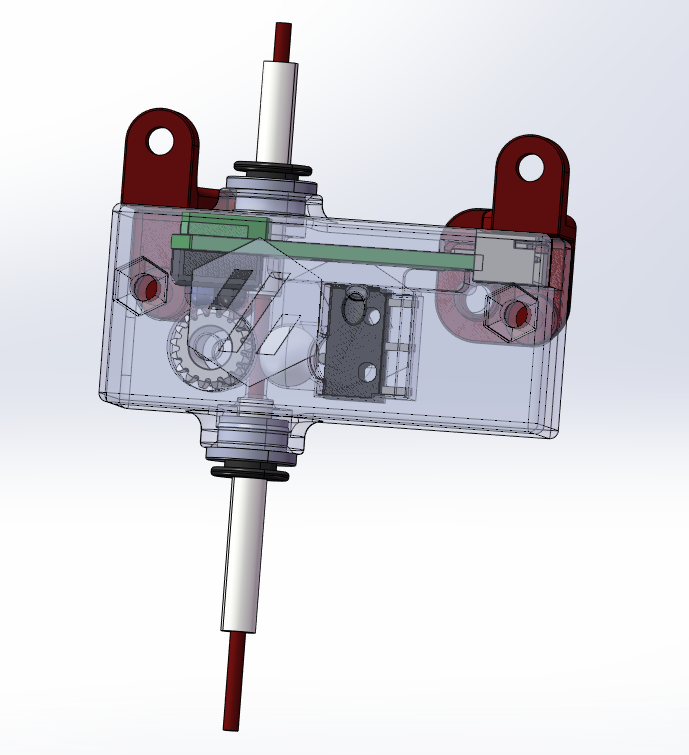

# MS5000_Filament_sensor [Back](./)
### 
3D打印机用耗材传感器，堵料/断料传感器打印文件

集成了光电传感器实现的堵料检测以及微动开关实现的断料检测。
功能上与必趣的SFS2.0完全一致。在触发距离上更为精确，尺寸更迷你。

QQ群：421291294

## 目标
### 本项目目标为:

当耗材用尽或堵头时暂停打印，避免打印失败。


## 总览

### 照片
### 


### 视频
 https://www.bilibili.com/video/BV1bw411q7jN

 
### [3D 模型](./Drawing)


## ## 材料清单 (BOM)
|序号	|种类	|名称	|数量	|备注
|--|--|--|--|--|
|1	|传动	|BMG Idler_Gear		|X1	|
|2	|传动	|Needle_Bearings 3x5x7	|X2	|
|3	|传动	|Shaft 3x20mm		|X1	|	
|4	|传动	|Metal_ball 7mm 	|X1	|
|5	|传动	|气动插头 ECAS04 v3	|X2	|
|6	|电子	|[TCRT5000](https://)	|X1	|
|7	|电子	|XH2.54 4Pin Male Connector	|X1	|
|8	|电子	|Wire 24AWG  20mm	|x2	|
|9	|紧固件	|M3X18 BHCS		|X2	|
|10	|紧固件	|M3_Hex_Nut		|X2	|
|11	|紧固件	|M3 Threaded Insert	|X2	|


### 效果图




## 简要说明
调试：
1.确定硬件没有问题
	1.1 插入耗材能够触发微动开关。
		检查接线是否可靠
		检查微动开关。
		检查钢珠尺寸
	1.2 缓慢拖动耗材指示灯闪烁。
		检查电源是否已正确连接
		抽动耗材时BMG齿轮是否能够顺畅转动
		BMG齿轮表面是否洁净
		TCRT模块是否工作正常
以上如果有万用表检查更佳
	当插入耗材，GND与断料信号角之间为开路，反之闭合。
	当缓慢抽动耗材，GND与堵料信号之间会不停的转换高低电平。

2.确定断料与堵料定义了正确的IO，如果将两者搞反，可能会不停的暂停打印
	如遇到问题，界面分别关闭断料和堵料的开关，来查找确定哪个部分的问题。

## 配置

配置可参考必趣的SFS2.0

### [filament_motion_sensor][¶](https://www.klipper3d.org/zh/Config_Reference.html#filament_motion_sensor "Permanent link")


耗材移动传感器。使用一个在耗材通过传感器时输出引脚状态会发生变化来检测耗材插入和耗尽。

更多信息请参阅[命令参考](https://www.klipper3d.org/zh/G-Codes.html#filament_switch_sensor)。

#### 拷贝下面配置到你的<Printer.cfg>文件中，你必须检查 **“switch_pin:”** 配置
```ini
[filament_switch_sensor MS5000_S]
## 开关传感器
pause_on_runout: True
## 当设置为True时，将在断料后立即执行暂停。请注意，如果pause_on_runout为False，将在断料后不执行，然后断料检测被禁用。默认是True。
switch_pin:^PB9#!PC15
## 设置引脚，必须提供此参数。
runout_gcode:
    RESPOND TYPE=error MSG="Filament Runout!"   #respond a warning message 
##   Need enable the "M118" and "RESPOND" extended commands first.
#    Beep                                         #Make a warning tone
#    Beep
#    M117 Filament Runout!                       #Sent a message to LCD
## 断料后要执行的 G 代码命令，如果pause_on_runout设置为 True 此 G 代码将在PAUSE 完成。默认不运行任何 G 代码命令。
#insert_gcode:
## 插入耗材丝后要执行的 G 代码命令，这默认是不运行任何 G-Code 命令，这会禁用插入检测。
#event_delay: 3.0
## 事件之间延迟的最短时间（以秒为单位）。在此时间段内触发的事件将被静默忽略。 默认值为 3 秒。
#pause_delay: 0.5
## 暂停命令之间的延迟时间，以秒为单位调度和执行 runout_gcode。 如果出现奇怪的暂停行为，则增加此延迟。默认为 0.5 秒。


[filament_motion_sensor MS5000_M]
detection_length: 1.5
##   触发传感器switch_pin引脚状态变化的最小距离。默认为 7 mm。
extruder: extruder
##   该传感器相关联的挤出机。必须提供此参数。
#   This parameter must be provided.
switch_pin:
##   连接到检测开关的引脚，必须提供此参数。
pause_on_runout: True
##  当设置为 "True "时，会在检测到耗尽后立即暂停打印机。请注意, 如果 pause_on_runout 为 False 并且没有定义runout_gcode的话, 
##  耗尽检测将被禁用。默认为 True。
#runout_gcode:
    #RESPOND TYPE=error MSG="Filament Runout!"   #respond a warning message 
##   Need enable the "M118" and "RESPOND" extended commands first. 
##   More infomation ：https://www.klipper3d.org/G-Codes.html?h=respond#respond
#    Bee_Mario_B                                 #Make a warning tone
#    M117 Filament Runout!                       #Sent a message to LCD
##   在检测到耗材耗尽后会执行的G代码命令列表。如果 pause_on_runout 被设置为 True，这个G-Code将在暂停后执行。
##   默认情况是不运行任何 G-Code 命令。
#insert_gcode:
##    在检测到耗材插入后会执行的 G-Code 命令列表。默认不运行任何 G-Code 命令，这将禁用耗材插入检测。
#event_delay: 3.0
##   事件之间的最小延迟时间（秒）。在这个时间段内触发的事件将被默许忽略。默认为3秒。
pause_delay: 0.5
##   暂停命令和执行 runout_gcode 之间的延迟时间, 单位是秒。如果在OctoPrint的情况下，增加这个延迟可能改善暂停的可靠性。
##   如果OctoPrint表现出奇怪的暂停行为，考虑增加这个延迟。
```

#### 下面配置是可选的，除非您想在检测到跳动时发出提示音。

1. 拷贝 ** <[Beeper.cfg](/Config/Beeper)>** 到 config 文件夹 

打开  <[Beeper.cfg](/Config/Beeper)> 检查**[output_pin BEEPER_pin]**中**pin:** 的配置

2.  拷贝下面配置到 **<Printer.cfg>** 
```ini
[include Beeper.cfg] 
```
3. 去除** <Printer.cfg>** 中 **[filament_motion_sensor S4] **下 **“runout_gcode:”**的注释
